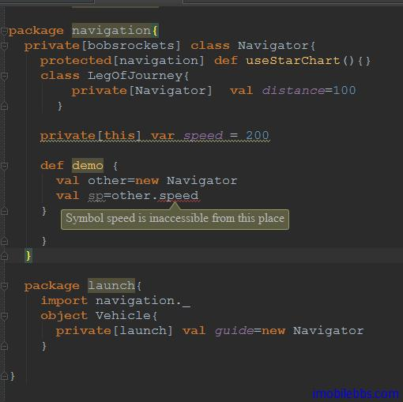

# 为访问控制修饰符添加作用域 #

Scala 的访问修饰符可以添加作用域参数。作用域的语法如下：
  
private[x]或protected[x]  

其中 x 代表某个包，类或者对象，表示可以访问这个 Private 或的 protected 的范围直到 X。

通过为访问修饰符添加作用域参数，可以非常精确的控制所定义的类型能够被其它类型访问的范围。尤其是可以支持 Java 语言支持的 package private，package protected 等效果。

下面的例子为这种用法的一个示例：

```
package bobsrockets
package navigation{
  private[bobsrockets] class Navigator{
    protected[navigation] def useStarChart(){}
    class LegOfJourney{
        private[Navigator]  val distance=100
      }
    private[this] var speed = 200
    }
  }
  package launch{
    import navigation._
    object Vehicle{
      private[launch] val guide=new Navigator
    }
}
```

在这个例子中，类 Navigator 使用 private[bobsrockets] 来修饰，这表示这个类可以被 bobsrockets 中所有类型访问，比如通常情况下 Vehicle 无法访问私有类型 Navigator，但使用包作用域之后，Vechile 中可以访问 Navigator。

这种技巧在分散在多个 Package 的大型项目时非常有用，它允许你定义一些在多个子包中可以访问，但对使用这些 API 的外部客户代码隐藏，而这种效果在 Java 中是无法实现的。

此外，Scala 还支持一种比 private 还要严格的访问控制，本例中的 private[this]，只允许在定义该成员的类型中访问，它表示该成员不仅仅只能在定义该成员的类型中访问，而且只能是由该类型本身访问。比如：本例中 speed，使用 protected[this]，speed，和 this.speed 只在定义该成员的实例中可以访问，下面的用法也是不合法的，即使它们也在 Navigator 里面。当由于是新创建的另外的实例，编译出错：


