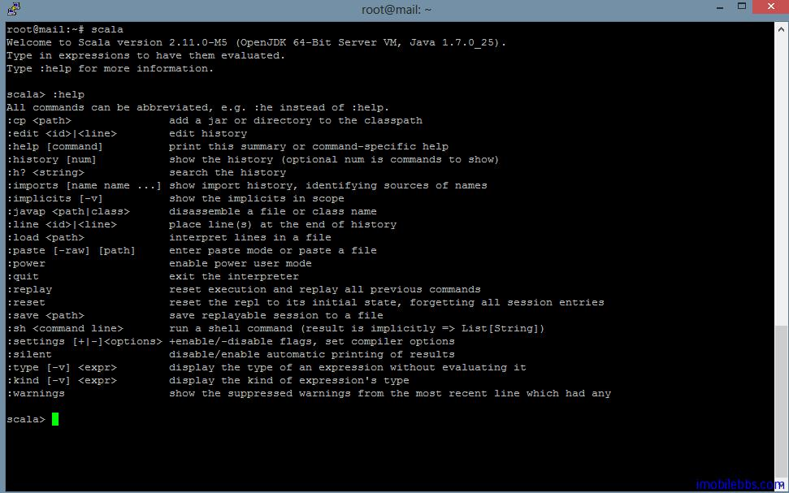

# 起步 Scala #

在详细介绍 Scala 编程之前，我们先用两篇文章给你一个 Scala 的整体印象，更重要的是让你开始写代码。强烈建议初学 Scala 编程者编译运行本教程的每个示例。如果你是个非常有经验的程序员，那么前面的这两篇文章可以使得你或的足够的知识开始编写一些实用的程序。

## 第一步，学习使用交互式 Scala 解释器  
 
开始使用 Scala 的最简单的方式是使用交互式 Scala 解释器，只要输入 Scala 表达式，Scala 解释器会立即解释执行该语句并输出结果。当然你也可以使用如 Scala IDE 或 IntelliJ IDEA 集成开发环境。不过本教程开始还是以这种交互式Scala解释器为主。

使用 Scala 解释器，首先你需要下载[安装Scala运行环境](http://www.imobilebbs.com/wordpress/archives/4771)。 然后再命令行输入 scala ,则进入 scala 解释器，下图为 Linux 环境下 scala 解释器界面：你可以使用： help 命令列出一些常用的 Scala 解释器命令，退出 Scala 解释器，输入

```
:quit
```



在 scala > 提示符下，你可以输入任意的 Scala 表达式，比如输入 1+2
解释器显示：

```
res0: Int = 3
```

这行显示包括：  


- 一个由 Scala 解释器自动生成的变量名或者由你指定的变量名用来指向计算出来的结果（比如 res0  代表 result0 变量）
- 一个冒号，后面紧跟个变量类型比如 Int
- 一个等于号
- 计算结果，本例为 1+2 的结果 3

resX 变量名可以用在之后的表达式中，比如 此时 res0=3，如果输入 res0 *3，则显示

```
 res1: Int =9
```

 

## 第二步：定义一些变量 ##

Scala 定义了两种类型的变量 val 和 var，val 类似于 Java 中的 final 变量，一旦初始化之后，不可以重新复制（我们可以称它为常变量）。而 var 类似于一般的非 final 变量。可以任意重新赋值。

比如定义一个字符串常变量： 
 
```
scala> val msg="Hello,World"
msg: String = Hello,World
```

这个表达式定义了一个 msg 变量，为字符串常量。它的类型为 string (java.lang.string)。 可以看到我们在定义这个变量时并不需要像 Java 一样定义其类型，Scala 可以根据赋值的内容推算出变量的类型。这在 Scala 语言中成为 “type inference”。当然如果你愿意，你也可以采用和 Java 一样的方法，明确指定变量的类型，如

```
scala> val msg2:String ="Hello again,world"
msg2: String = Hello again,world
```

不过这样写就显得不像 Scala 风格了。此外 Scala 语句也不需要以分号结尾。 如果在命令行中需要分多行输入，Scala 解释器在新行前面显示“|”，表示该行接着上一行。比如

```
scala> val msg3=
     | "Hello world 3rd time"
msg3: String = Hello world 3rd time
```

## 第三步：定义一些函数 ##

Scala 既是面向对象的编程语言，也是面向函数的编程语言，因此函数在 Scala 语言中的地位和类是同等第一位的。下面的代码定义了一个简单的函数求两个值的最大值：

```
scala> def max(x:Int,y:Int) : Int ={
     | if (x >y) x
     | else
     | y
     | }
max: (x: Int, y: Int)Int
```

Scala 函数以 def 定义，然后是函数的名称（如 max)，然后是以逗号分隔的参数。Scala 中变量类型是放在参数和变量的后面，以“：”隔开。这种做的一个好处是便与 “type inference”。刚开始有些不习惯（如果你是 Pascal 程序员会觉的很亲切）。同样如果函数需要返回值，它的类型也是定义在参数的后面（实际上每个 Scala 函数都有返回值，只是有些返回值类型为 Unit，类似为 void 类型）。

此外每个 Scala 表达式都有返回结果（这一点和 Java，C# 等语言不同），比如 Scala 的 if else 语句也是有返回值的，因此函数返回结果无需使用 return 语句。实际上在 Scala 代码应当尽量避免使用 return 语句。函数的最后一个表达式的值就可以作为函数的结果作为返回值。

同样由于 Scala 的 “type inference” 特点，本例其实无需指定返回值的类型。对于大多数函数 Scala 都可以推测出函数返回值的类型，但目前来说回溯函数（函数调用自身）还是需要指明返回结果类型的。

下面在定义个“没有”返回结果的函数（其它语言可能称这种无返回值的函数为程式）。

```
scala> def greet() = println("hello,world")
greet: ()Unit
```

greet 函数的返回值类型为 Unit 表示该函数不返回任何有意义的值，Unit 类似于 Java 中的 void 类型。这种类型的函数主要用来获得函数的“副作用”，比如本函数的副作用是打印招呼语。

## 第四步 编写 Scala 脚本 ##

Scala 本身是设计用来编写大型应用的，但它也可以作为脚本语言来执行，脚本为一系列 Scala 表达式构成以完成某个任务，比如前面的 Hello World 脚本，你也可以使用脚本来实现一些比如复制文件，创建目录之类的任务。

## 第五步： 使用 while 配合使用if实现循环 ##

下面的代码使用while实现一个循环：

```
var i=0
while (i < args.length) {
  println (args(i))
  i+=1
}
```

为了测试这段代码，可以将该代码存成一个文件，比如 printargs.scala，将该语句作为脚本运行，比如在命令行中输入

```
scala printargs.scala I like Scala
```

则显示：

 

这里要注意的是 Scala 不支持＋＋i,i++ 运算符，因此需要使用 i＋＝1 来加一。 这段代码看起来和 Java 代码差不多，实际上 while 也是一个函数，你自动可以利用 scala 语言的扩展性，实现while 语句，使它看起来和 Scala 语言自带的关键字一样调用。Scala访问数组的语法是使用()而非[]。

这里介绍了使用 while 来实现循环，但这种实现循环的方法并不是最好的 Scala 风格，在下一步介绍使用一种更好的方法来避免通过索引来枚举数组元素。

## 第六步：使用 foreach和 for 来实现迭代 ##

第五步使用 while 来实现循环，和使用 Java 实现无太大差异，而 Scala 是面向函数的语言，更好的方法是采用“函数式“风格来编写代码。比如上面的循环，使用 foreach 方法如下：

```
args.foreach(arg => println(arg))
```

该表达式，调用 args 的 foreach 方法，传入一个参数，这个参数类型也是一个函数（ lambda 表达式，和 C# 中概念类似）。这段代码可以再写的精简些，你可以利用 Scala 支持的缩写形式，如果一个函数只有一个参数并且只包含一个表达式，那么你无需明确指明参数。因此上面的代码可以写成：

```
args.foreach( println)
```

Scala 中也提供了一个称为 “for comprehension” 的比 Java 中 for 表达式功能更强大。“for comprehension” （抱歉找不到合适的中文词来翻译这个术语,姑且使用 for 表达式）将在后面介绍，这里先使用 for 来实现前面的例子：

```
for (arg <-args)
  println(arg)
```
