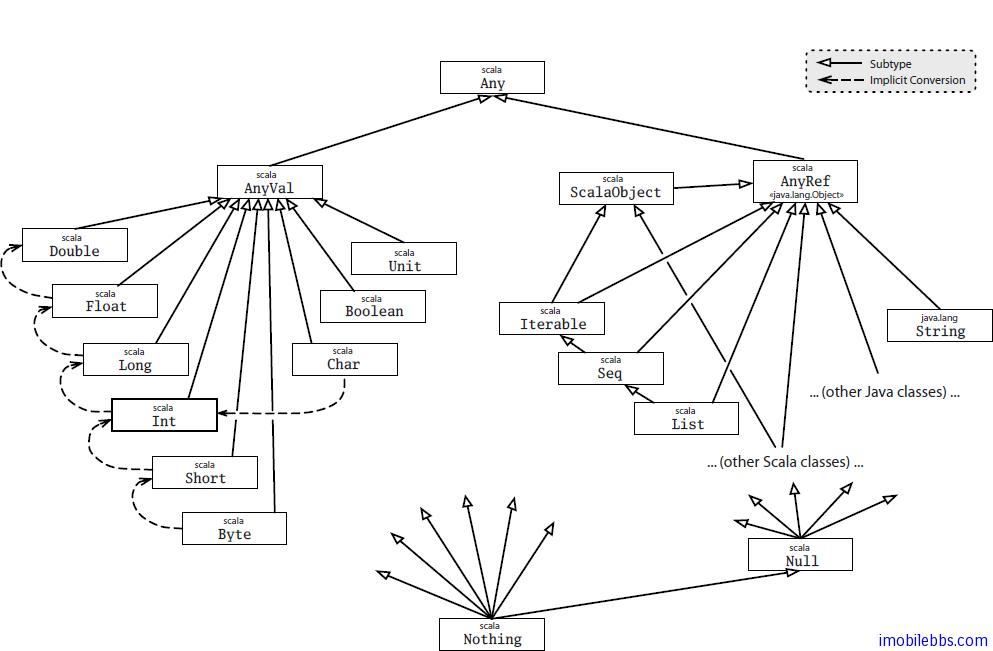

# 所有类的公共子类–底层类型 #

前面我们给出了 Scala 的类的一个关系图：



在这张图的最下方我们可以看到有两个类，scala.Null 和 scala.Nothing。 这两个类的作用是 Scala 支持统一方式用来处理面向对象的一些边角情况。因为它们在类层次图的下方，因此也称为底层类型。
 
类 Null 代表 null 引用，它是所有引用类（每个由 AnyRef 派生的类）的子类。Null 和值类型不兼容，也就是比如说，你不能把 null 赋值给一个整数类型变量：

```
scala> val i:Int=null
<console>:7: error: an expression of type Null is ineligible for implicit conversion
       val i:Int=null
```

Nothing 类型为图中类层次关系的最下方，它是所有其他类的子类，然而这个类型没有任何实例（也就是没有任何值对应 Nothing 类型）前面提到，Nothing 类型的一个用法是示意应用程序非正常终止，比如 Predef 的有一个 error 方法：

```
def error(message:String) :Nothing =
  throw new RuntimeException(message)
```

error 的返回类型就是 Nothing，告诉调用者该方法没有正常退出（抛出异常）。正因为 Nothing 为所有其它类型的子类，你可以灵活使用如 error 这样的函数。比如：

```
def divide(x:Int,y:Int):Int=
  if(y!=0) x/y
  else error("Cannot divide by Zero")
```

if “then”分支的类型为 Int（x/y)，else 分支的类型为 error 返回值，其类型为 Nothing，因为 Nothing 为所有类型的子类，它也是 Int 的子类，因此 divide 的类型为 Int。
