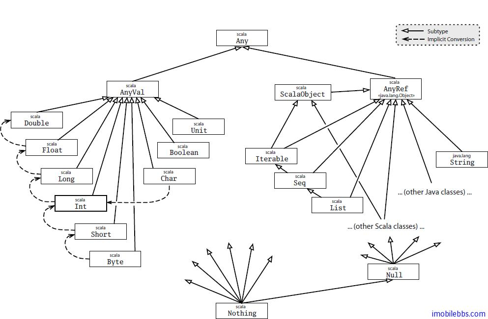

# Scala 的类层次关系 #

前面我们介绍了 Scala 的类的继承，本篇我们介绍 Scala 语言自身定义的类的层次关系，在 Scala 中，所有的类都有一个公共的基类称为 Any，此外还定义了所有类的子类 Nothing，下面的图给出的 Scala定义的类层次关系的一个概要：



由于所有的类都继承自 Any，因此 Scala 中的对象都可以使用==,!=,或 equals 来比较，使用##或 hashCode 给出 hash 值，使用 toString 转为字符串。Any 的==和!=定位为 fianl，因此不可以被子类重载。==实际上和 equals 等价，!=和 equals 的否定形式等价，因此重载 equals 可以修改==和!=的定义。

根类 Any 有两个子类：AnyVal 和 AnyRef。AnyVal 是 Scala 里每个内建值类型的父类。有九个这样的值类型：Byte，Short，Char，Int，Long，Float，Double，Boolean 和 Unit。其中的前八个对应到 Java 的基本数值类型，它们的值在运行时表示成 Java 的类型。Scala 里这些类的实例都写成字面量。例如，42 是 Int 的实例，’x’是 Char 的实例，false 是 Boolean 的实例。值类型都被定义为即是抽象的又是 final 的，你不能使用 new 创造这些类的实例。

```
scala> new Int
<console>:8: error: class Int is abstract; cannot be instantiated
              new Int
              ^
scala> 
```

另一个值类，Unit，大约对应于 Java 的 void 类型；被用作不返回任何有趣结果的方法的结果类型。 Unit 只有一个实例值，被写作().

值类支持作为方法的通用的数学和布尔操作符。例如，Int 有名为+和*的方法，Boolean 有名为||和&&的方法。值类也从类 Any 继承所有的方法。你可以在解释器里测试:

```
scala> 42 toString
res3: String = 42
scala> 42.hashCode
res6: Int = 42
```

可以看到 Scala 的值类型之间的关系是扁平的，所有的值类都是 scala.AnyVal 的子类型，但是它们不是互相的子类。代之以它们不同的值类类型之间可以隐式地互相转换。例如，需要的时候，类 scala.Int 的实例可以自动放宽（通过隐式转换）到类 scala.Long 的实例。隐式转换还用来为值类型添加更多的功能。例如，类型 Int 支持以下所有的操作：

```
scala> 42 max 43
res0: Int = 43
```

```
scala> 42 min 43
res1: Int = 42
```

```
scala> 1 until 5
res2: scala.collection.immutable.Range = Range(1, 2, 3, 4)
```

```
scala> 1 to 5 
res3: scala.collection.immutable.Range.Inclusive = Range(1, 2, 3, 4, 5)
```

```
scala> 3.abs
res4: Int = 3
```

```
scala> (-3).abs
res5: Int = 3
```

这里解释其工作原理：方法 min，max，until，to 和 abs 都定义在类 scala.runtime.RichInt 里，并且有一个从类 Int 到 RichInt 的隐式转换。当你在 Int 上调用没有定义在 Int 上但定义在 RichInt 上的方法时，这个转换就被应用了。

类 Any 的另一个子类是类 AnyRef。这个是 Scala 里所有引用类的基类。正如前面提到的，在 Java 平台上 AnyRef 实际就是类 java.lang.Object 的别名。因此 Java 里写的类和 Scala 里写的都继承自 AnyRef。如此说来，你可以认为 java.lang.Object 是 Java 平台上实现 AnyRef 的方式。因此，尽管你可以在 Java 平台上的 Scala 程序里交换使用 Object 和 AnyRef，推荐的风格是在任何地方都只使用 AnyRef。

Scala 类与 Java 类不同在于它们还继承自一个名为 ScalaObject 的特别的 Marker Trait（Trait 我们在后面再进一步解释）。
