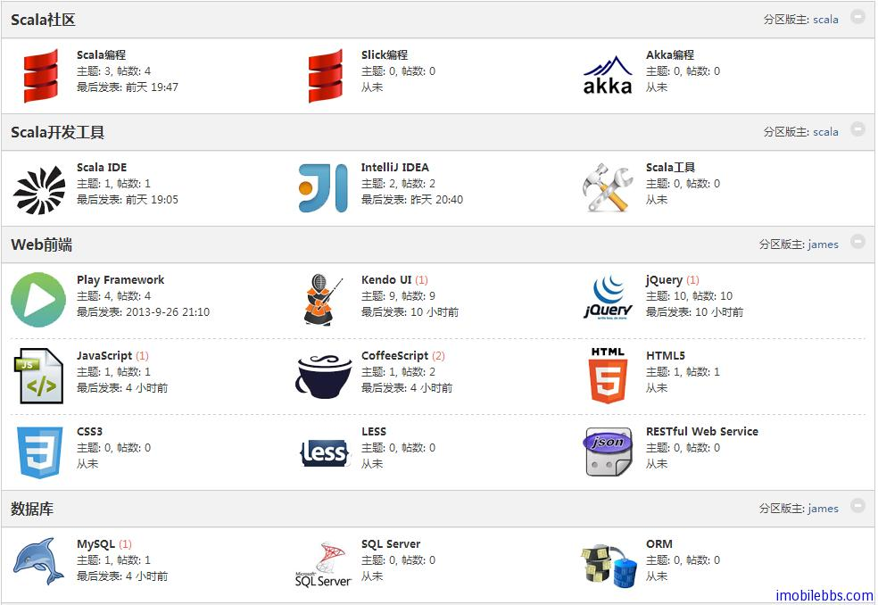
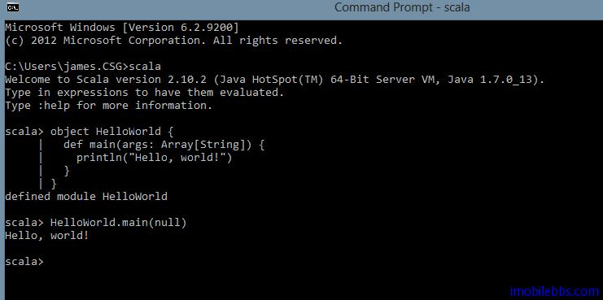
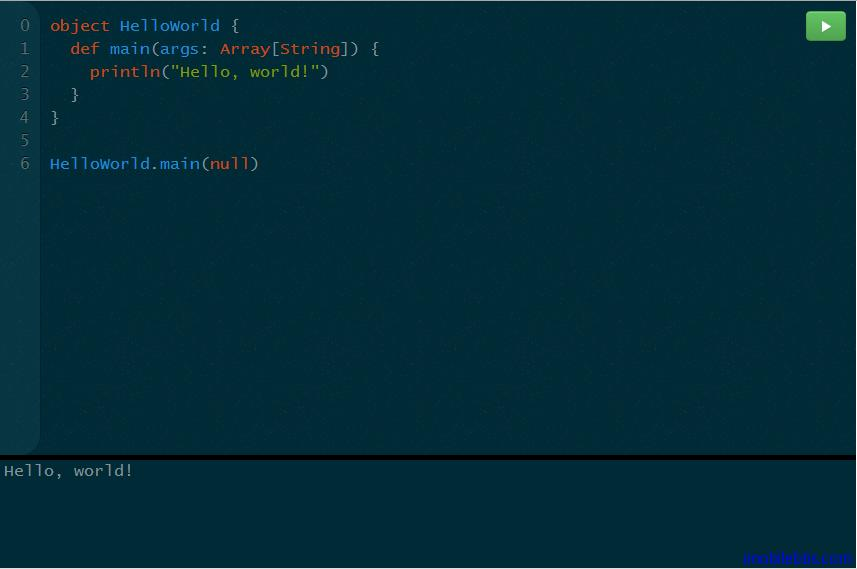
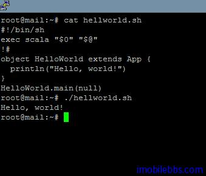

# 开始神奇的 Scala编程之旅 #

前面写了四篇 Scala Play Framework 开发教程，起了个头，个人觉得 Scala 应用会越来越广泛，因此开通了 Scala 中文社区论坛以达到推广 Scala 开发的目的。该论坛设立了 Scala 编程（包括 Slick，Akka 编程），Scala 开发工具（ Scala IDE，IntelliJ IDEA 等），目前使用Scala最广泛的应用是开发 Web 应用，所有论坛列出了使用 Play Framework 开发 Web 应用的一些相关技术（HTML5， CSS3，Kendo UI/jQuery，JavaScript/CoffeeScript ，LESS 和R ESTFul Web服务），和常见的数据库服务器（MySQL和SQL Server），以后可能还会添加一些相关平台如（Scaladin，Android，Spring)。下面是目前论坛的主要板块：

 

论坛新开通，目前还没有太多的内容，希望得到广大对 Scala 有兴趣的技术人员的支持，在今后的三年逐渐使得论坛成为 Scala 中文的主要技术论坛。

学习 Scala 的最好的方法取决于你已有的编程知识，很多人觉得同时使用教程和编程实践相结合的方法最有效，本教程将带你走入 Scala 编程的旅程，同时希望你在看本教程的同时，通过尝试输入本教程的例子，使用 Scala 编译器查看结果，以便能很快的掌握 Scala 编程。学习完 Scala 编程的基本知识后，我们再继续 Play Framework 开发教程和其它相关知识。

学习本教程，首先需要安装好Scala运行环境，你可以使用命令行，Notepad，或者使用 Scala IDE 或是 IntelliJ，如果你不想安装任何软件，你可以通过在线 Scala 编译器 Scalakata.com ，通过浏览器来练习 Scala 编程。

最后我们以每个编程语言开发教程都会有的应用 “Hello，World” 来结束本篇文章。

```
object HelloWorld {
  def main(args: Array[String]) {
    println("Hello, world!")
  }
}
```

这段代码对于Java程序员来说似承相识，它包含一个 main 方法，用来打印 “Hello,World” 这个问候语。
这段代码，你可以使用命令行交互式执行：

 

如果使用 ScalaKata.com 在线执行：

 

如果你不想使用这种交换式运行方式，你可以使用任何文本编辑器或是使用 IDE 来运行 Scala 代码。如果使用普通的编辑器，在把代码保存为 HelloWorld.scala 之后，可以在命令行使用 scalac (和 javac 使用方法类似）来编译 Scala 代码。

```
scalac HelloWorld.scala
```

运行 Scala 应用

```
scala HelloWorld
```

注意 scalac 编译也是生产 .class 文件（和 Java 一样），因此你也可以通过 -d -cp 等选项指定生产的 class 的目录和运行应用时 class 的访问目录。 

而使用 scala 来运行应用时，无需再调用 HelloWorld.main(null).Scala 会自动执行指定类的 main 方法，因此下面代码为 HelloWorld.scala 的内容：

```
object HelloWorld {
  def main(args: Array[String]) {
    println("Hello, world!")
  }
}
```

你也可以把 Scala 代码作为脚本语言来运行，比如使用下面代码在 Ubuntu 些运行

```
 #!/bin/sh
exec scala "$0" "$@"
!#
object HelloWorld extends App {
  println("Hello, world!")
}
HelloWorld.main(null)
```

 
